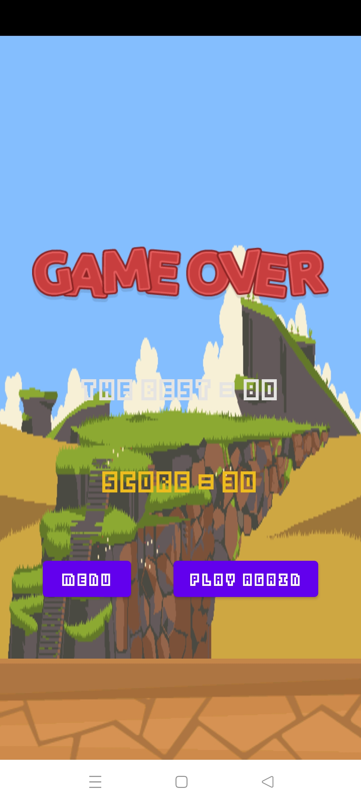
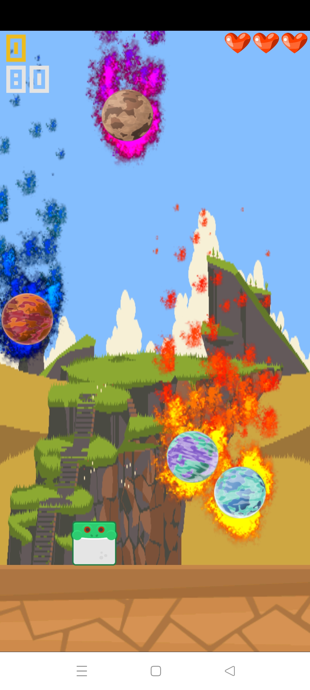
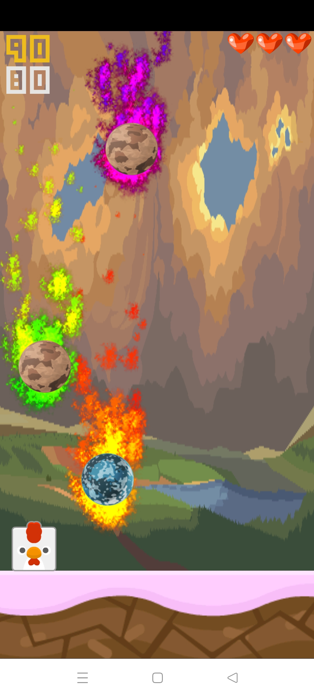

# Save the Animal Farm
The goal of the game is to avoid falling planets.
## Screenshots
|  |  |  |  |
|-------------------------------------|-------------------------------------|----------------------------------------|----------------------------------------|

## Download

#### Newest version

The latest version is not available on Google Play due to recent changes in their policy. You can
download the updated version with new backgrounds and improved animations, from GitHub:

https://github.com/bochunator/Save-the-Animal-Farm/releases/download/2.0/app-release.apk

#### ~~Google Play~~

The game is no longer available due to Google's policy.

~~https://play.google.com/store/apps/details?id=bochunator.savetheanimalfarm~~

## About project

My main purpose was to learn android environment, because I wanted to show my programming skills to people who would ask about my interests.

## Why java?

I've chosen Java because it was easier to learn when I had done some C++ programs.

I heard about java when I was a kid, so it also had an impact on my decision. Java is used not only in mobile applications, so I've chosen java.

## What have I learned?

- How game loops work, I've found they are similar to PLC controllers and microcontrollers as arduino.
- Activities-lifecycle concept in android.
- SurfaceView which purpose is to provide a surface in which a secondary thread can render into the screen.
- Why Garbage collector should not be used in game loop.
- Understood the game publishing process on the Google Play Store, including requirements for icons, descriptions, promotional graphics, etc.

## What I would change, if I had to do new game

- Use vulkan for rendering, due to its multithreading advantages.
- Change programming language to C++.
